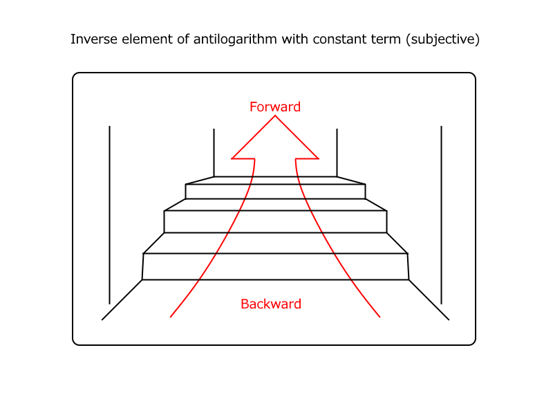
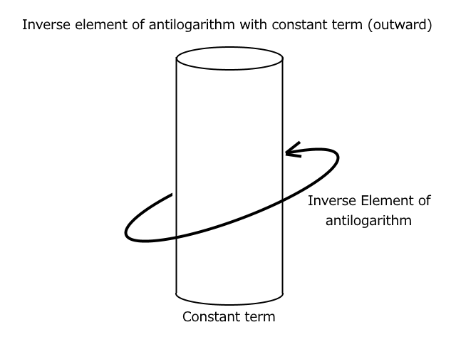
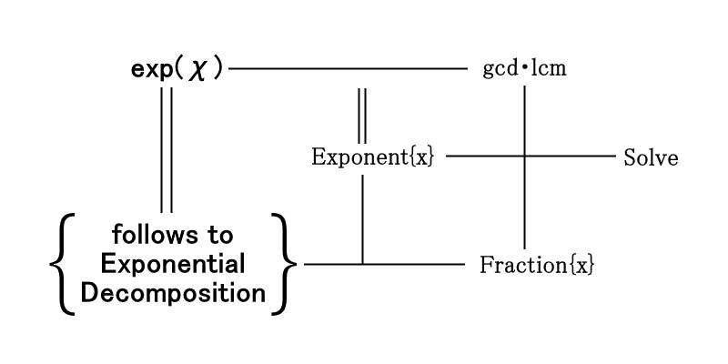
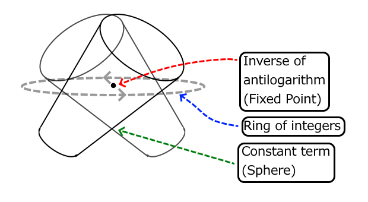
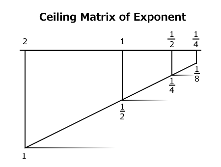

# 1. 指数関数の分解公式

　指数関数を知るについて，言語実装の観点から見てみよう。  
　現在，浮動小数点規格として`IEEE-754`がある。この規格では実数が限りなく0に近い状態でも持ちこたえるようにと非正規化数 *denormalized number* が組み込まれ，保証されている。そのため，これに対応しているならば， `(1 / MAX)` は本来には0.0であるにも関わらず，数値として持ちこたえている。  
　この規格は，`1.0`から離れれば離れるほど正確性を失っていき，`MIN`や`MAX`に近づくにつれ原型は保たれなくなる。それで，10進に戻せる桁数として，単精度では6，倍精度では15，拡張倍精度では18，4倍精度では33が保証されている。  
　この正確性は33などといったごく身近な数値であっても，指数関数では天文学のような数値に及びやすい。ゆえに，`exp(MAX)`ではむしろオーバフローしてくださいとベンチマークを図っているに等しいものになる。  
　したがって，すでに原型のない非正規化数の指数を取ろうことは，アンダフローから何かサンプルを採取しようとしているに近い。  

　ついで，`C/C++`のプリミティブ型の実装状況でこれを鑑みてみる。`exp2()`は最小・最大は各々`-1019`，`1023`となりうる。範囲外は，負はアンダフローとして`0.0`，正はオーバフローとして`Infinity`を返すようコンテクストスイッチさせるのが望ましい。しかしながら，ベンチマークでは面白い結果を得られた。

```
#include <float.h>
#include <math.h>

#include <stdio.h>

int
main(void)
{
	int i;

	puts("Calculation Range(MIN..MAX) of:");
	
	for (i = 0; 0.0 != expf(i); i--);
	printf("expf(): %d", i);
	for (i = 0; (1.0/0.0) != expf(i); i++);
	printf("..%d", i);
	printf(" (Logical: %d..%d)\n",
		   (int)(FLT_MIN_10_EXP / log10(M_E)),
		   (int)(FLT_MAX_10_EXP / log10(M_E)));
	
	for (i = 0; 0.0 != exp(i); i--);
	printf("exp(): %d", i);
	for (i = 0; (1.0/0.0) != exp(i); i++);
	printf("..%d", i);
	printf(" (Logical: %d..%d)\n",
		   (int)(DBL_MIN_10_EXP / log10(M_E)),
		   (int)(DBL_MAX_10_EXP / log10(M_E)));
	
	for (i = 0; 0.0 != expl(i); i--);
	printf("expl(): %d", i);
	for (i = 0; (1.0/0.0) != expl(i); i++);
	printf("..%d", i);
	printf(" (Logical: %d..%d)\n",
		   (int)(LDBL_MIN_10_EXP / log10(M_E)),
		   (int)(LDBL_MAX_10_EXP / log10(M_E)));

	for (i = 0; 0.0 != exp2f(i); i--);
	printf("exp2f(): %d", i);
	for (i = 0; (1.0/0.0) != exp2f(i); i++);
	printf("..%d", i);
	printf(" (Logical: %d..%d)\n",
		   (int)(FLT_MIN_10_EXP / log10(2)),
		   (int)(FLT_MAX_10_EXP / log10(2)));
	
	for (i = 0; 0.0 != exp2(i); i--);
	printf("exp2(): %d", i);
	for (i = 0; (1.0/0.0) != exp2(i); i++);
	printf("..%d", i);
	printf(" (Logical: %d..%d)\n",
		   (int)(DBL_MIN_10_EXP / log10(2)),
		   (int)(DBL_MAX_10_EXP / log10(2)));
	
	for (i = 0; 0.0 != exp2l(i); i--);
	printf("exp2l(): %d", i);
	for (i = 0; (1.0/0.0) != exp2l(i); i++);
	printf("..%d", i);
	printf(" (Logical: %d..%d)\n",
		   (int)(LDBL_MIN_10_EXP / log10(2)),
		   (int)(LDBL_MAX_10_EXP / log10(2)));
	
	return 0;
}
```

　結果は以下:  

```
Calculation Range(MIN..MAX) of:
expf(): -104..89 (Logical: -85..87)
exp(): -746..710 (Logical: -706..709)
expl(): -11400..11357 (Logical: -11354..11356)
exp2f(): -150..128 (Logical: -122..126)
exp2(): -1075..1024 (Logical: -1019..1023)
exp2l(): -16446..16384 (Logical: -16380..16383)
```

　なんと非正規化数も`0.0`としてではなく演算結果としている。これは意外だった。筆者はてっきり`MAX_EXP`や`MIN_EXP`などの機械定数*machine constant*の敷居を守っていると思っていたからである。  
　言語実装を考慮すると，計算できる限界を計測しつつ，計測不能であれば `x < 0 ? 0.0 : HUGE_VAL;` としてオーバフローを防ぐようコードする必要がある。  
 
 　指数法則などでよく見受ける商と剰余，合同式は，この分解公式では有理関数近似として自明である。この自明は特に平方数和に現れる。  
　二進指数でこれを考えよう。平方数和は二進指数について  

$2^{x} = 2^{\sqrt(x)^{2}}$

　を成り立たせていることを示しており，したがって  

$x = \sqrt{x}^{2}$

　で自明である。  

　このため，平方数和は$2^{N}$ と等価であった場合，  


|自然数|2^x|平方数和|
|--:|--:|--:|
|0|1|1^2|
|1|2|1^2+1^2|
|2|4|2^2|
|3|8|2^2+2^2|
|4|16|4^2|
|5|32|4^2+4^2|
|6|64|8^2|
|7|128|8^2+8^2|

　このような二項係数 *binomial coefficients* な関係が成り立つのは自然である。  
　ここで，平方数和を素因数分解することを考えよう。自然指数の場合は $e^{x}$ なのだが，二進は平方数和と一致するため，その時は $2^{N}$ が関係式となる。したがって  

```
exp2(0) = 2^0
exp2(1) = 2^1
exp2(2) = 2^2
exp2(3) = 2^3
 :
 :
```

　xが自然数であった場合にはx自体が2の分解された素因数そのものになる。  
　素因数分解は解が真数だった場合，最小公倍数と素因数の余りは0となる。この場合は合同式が等式であるから最小公倍数をそのまま解とすればよい。ところが余りが0でない場合は更に分解式が必要になる。これは合同式としては，特殊解 *special solution* である。そこでこれを真数分解 *antilogarithm factorization*  と定義しよう。  
　真数分解について，以下に自然数 $\mathbb{N}$ と真数の関係を示す。平方数和はここで周期関数としてではなく単に真数を説明するための係数であることが裏付けられる。  

|自然数|2^x|平方数和|素因数分解|別解|真数分解|
|--:|--:|--:|--:|--:|--:|
|0|1|1^2|2^0|2^0_0|真数|
|1|2|1^2+1^2|2^1|2^1_0|真数|
|2|4|2^2|2^2|2^2_0|真数|
|3|8|2^2+2^2|2^3|2^2_1|2^2*2^1|
|4|16|4^2|2^4|2^4_0|真数|
|5|32|4^2+4^2|2^5|2^4_1|2^4*2^1|
|6|64|8^2|2^6|2^4_2|2^4*2^2|
|7|128|8^2+8^2|2^7|2^4_3|2^4*2^3|
|8|256|16^2|2^8|2^8_0|真数|
|9|512|16^2+16^2|2^9|2^8_1|2^8*2^1|
|10|1024|32^2|2^10|2^8_2|2^8*2^2|
|11|2048|32^2+32^2|2^11|2^8_3|2^8*2^3|
|12|4096|64^2|2^12|2^8_4|2^8*2^4|
|13|8192|64^2+64^2|2^13|2^8_5|2^8*2^5|
|14|16384|128^2|2^14|2^8_6|2^8*2^6|
|15|32768|128^2+128^2|2^15|2^8_7|2^8*2^7|
|16|65536|256^2|2^16|2^16_0|真数|
|17|131072|256^2+256^2|2^17|2^16_1|2^16*2^1|
|18|262144|512^2|2^18|2^16_2|2^16*2^2|
|19|524288|512^2+512^2|2^19|2^16_3|2^16*2^3|
|20|1048576|1024^2|2^20|2^16_4|2^16*2^4|
|21|2097152|1024^2+1024^2|2^21|2^16_5|2^16*2^5|
|22|4194304|2048^2|2^22|2^16_6|2^16*2^6|
|23|8388608|2048^2+2048^2|2^23|2^16_7|2^16*2^7|
|24|16777216|4096^2|2^24|2^16_8|2^16*2^8|
|25|33554432|4096^2+4096^2|2^25|2^16_9|2^16*2^9|
|26|67108864|8192^2|2^26|2^16_10|2^16*2^10|
|27|134217728|8192^2+8192^2|2^27|2^16_11|2^16*2^11|
|28|268435456|16384^2|2^28|2^16_12|2^16*2^12|
|29|536870912|16384^2+16384^2|2^29|2^16_13|2^16*2^13|
|30|1073741824|32768^2|2^30|2^16_14|2^16*2^14|
|31|2147483648|32768^2+32768^2|2^31|2^16_15|2^16*2^15|

　真数分解は特に合同式に説明するのは容易なものである。二進指数の変数の小数部がちょうど`1/2`となるとき，

```
exp2(0.5) = 1.41421356...
exp2(1.5) = 2.82842712...
exp2(2.5) = 5.65685425...
exp2(3.5) = 11.3137085...
exp2(4.5) = 22.627417...
exp2(5.5) = 45.254834...
```

　平方数和と近似する。  
　二進指数の`0.5`と`1.0`は実数の主要根を解に持つため，各々平方根を$\sqrt{2}, \sqrt{8}, \sqrt{32},\ldots$と同じくするのだが，これを素因数分解すると

```
exp2(0+0.5) =  1 * sqrt(2) = 1.41421356...
exp2(1+0.5) =  2 * sqrt(2) = 2.82842712...
exp2(2+0.5) =  4 * sqrt(2) = 5.65685425...
exp2(3+0.5) =  8 * sqrt(2) = 11.3137085...
exp2(4+0.5) = 16 * sqrt(2) = 22.627417...
exp2(5+0.5) = 32 * sqrt(2) = 45.254834...
```

　となり，したがって

```
exp2(0+0.5) = 2^0 * 2^0.5 = 1.41421356...
exp2(1+0.5) = 2^1 * 2^0.5 = 2.82842712...
exp2(2+0.5) = 2^2 * 2^0.5 = 5.65685425...
exp2(3+0.5) = 2^3 * 2^0.5 = 11.3137085...
exp2(4+0.5) = 2^4 * 2^0.5 = 22.627417...
exp2(5+0.5) = 2^5 * 2^0.5 = 45.254834...
```

　分解公式では，周期関数として小数部 $0 < x < 1$は式展開によって得られるところの解が全く同じという規則があり，これはいわゆる指数法則とも一致する。ただし単純に合同式だというのであれば，これは値域として現れる変数なのであって，平方根に現れるのではない。実際，更に分解した`2^-2`といったxが従う二項係数の定数項は一定するものでもない。一次元な部分関数も含まれているのであって，逆数の集合である。これを真数の逆元 *inverse element of antilogarithm* と定義している。  
　近似式では，この真数の逆元とは無限級数が2のべき乗と等しいとき累乗の総和が二項係数として有理数にはっきりと現れる。くしくも$\sqrt{2}$のような無理数は真数ともなって，実数の主要根を解にする。ここで，自然指数と自然対数は自然数との計算に併用して用いられるところではあるが，関数自体は自然数を持っているとはいいがたく，解として得られたところの累乗根に有理数の現れが自明という性質を持つものなのである。  
　なお有理関数近似で二進は二乗根・常用は三乗根を各々整数根として持つのだが，  

$2^{\frac{1}{2}}$

　が  

$\sqrt{2}$

　と等価なのは  

$x=\frac{\ln(2)+4\imath\pi{n}}{2\ln(2)},\,n\in\mathbb{Z}$

　として偶然に一致しているため，導関数になることはあっても参照値にすぎていない節がある。  

　敢えて射影として見るならば，逆元は画像のような周期性を持つのではないかと予想する。




　逆元は主観としては階段を上ろうとしているようなイメージであり，外観としては定数項を軸に斜めに周期しているかのようなイメージである。  
　指数関数は多価性を持つものではあるが，累乗根が解に現れるものもあり，リーマン球面に好まれる一次元な変数は射影に捉えることができていない。ただし，周期性$\imath\pi$について自明であるのは有理関数近似を現すものとして有効である。  
　これを「変形合同式」として改めるところ，式評価$gcd \cdot lcm$は指数部と等価となり，変数xが従う指数分解は仮数部に近似する。ただしこの仮数でさえも式評価$gcd \cdot lcm$からなるので，指数部と仮数部の積こそが解なのである。この関係は，もしかしたら中間積なのかもしれない。  

　周期性について，整数部は一次元な最小公倍数，小数部は定数項な最大公約数を持つ。小数部のみであればリーマン球面の射影を得ることは可能である。  
 


　二進指数の分解公式は説明が可能であった。真数分解を定理とすれば，自然指数についても応用の形で説明することが容易になる。  

```
exp(0+0.5) = e^0 * e^0.5 = 1.64872...
exp(1+0.5) = e^1 * e^0.5 = 4.48169...
exp(2+0.5) = e^2 * e^0.5 = 12.1825...
exp(3+0.5) = e^3 * e^0.5 = 33.1155...
exp(4+0.5) = e^4 * e^0.5 = 90.0171...
exp(5+0.5) = e^5 * e^0.5 = 244.692...
```

　ここで，$e$はオイラーの定数 2.718281828459... であり，対数ではネイピア数 *napier's constant* である。  
　指数・対数の関係について，仮数部は全て無理数であることから，自然数とこれが重なるのは偶然の一致である。これの有理関数近似は興味深いほどシンメトリなのであって，指数にはないものは対数にはあって，逆に対数にないものは指数にはある。  
　対数ではn次連立な和集合であるが，指数は無限級数な積集合である。積集合は分解されるaとbにつき，否定的な対象性を持つ。この関係は特異なので，積集合は以下のような無理級数展開が成り立つ。  

$\displaystyle \lim_{0 \to a} \sum_{b=e}^{s} a+b \neq s+b \neq e^{a}$

　ここに名づけるとすれば「逆元定理 *inverse element's theorem* 」である。重みづけする係数aとbの加法が条件数として係数sにbを加算するのとが不一致であれば，eのa乗とも不一致である。  
　有理数としては複素数値計算になじみ深い整数環が近似するので，オイラーの公式 $e^{\imath\theta}=\cos\theta+\imath\sin\theta$ からすれば，リーマン球面や虚数根，絶対値(偏角)などの実数の根を期待しがちだが，係数は行列の積であり，オイラー積分とも強い関係を持つに至る。  
　逆元を定点としたとき，係数の整数環を巡るように見てみよう。すると下の図のようになる。  



　整数環は$\sqrt{2}$と解が全く等しかったりするため，整数論的解釈はむしろ豊富な話題さえありそうである。これは閉形式を得るための学問に至ればピタゴラスの定理にも近似するので平方数和は総和と数えることもできようか。しかし平面内曲線で考えたうえユークリッド空間での弧長を調べるのが実成果であって，真数の逆元がいかなる存在なのかからは遠のいた話題である。  

　指数関数の近接傍整数は天井関数であり，床関数を解に持たない。逆に対数関数の近接傍整数は床関数であって，相対的と言わんばかりに天井関数を解に持っていない。そこで天井関数で定点を揃えた行列式で関係を見てみると，傾斜45度から底が抜けた通路を見ているような箱型になる。  



　これを天井行列式と呼ぶことにする。  
　ピタゴラス数との一致は指数分解の解に現れるものなのであって，単なる偶然の一致である。そのため自然数の総和が分解公式に直接的な関係をもたらしているとはいいがたい。  
　解を以て行列式に評価すると，天井の2を定数$e$としたときは床の1は$\ln(2)$となり，傾斜として得て自然対数が成り立ち，このとき$\ln(2)$の指数は対数にとって底ということができる。指数は天井なので床がないことから底ということもないし解も持っていない関係がある。  
　また指数には床がないからこそ，基底2の床関数1が不等式である根拠も確認できる。つまり指数・対数において基底1は存在しない。  

　逆元は代数方程式であると考えると，その微分は *t^x* であろう。ラプラス変換で逆元定理を考えると  

$\int_0^\infty t^x \cdot e^{-st} \cdot dt$
$=\frac{1}{s^x} \int_0^\infty (st)^x \cdot e^{-st} \cdot dt$

　を得る。  

　ここで$st$を$\tau$に置き換えて積分を考えれば  

$= \frac{1}{s^x}\int_0^\infty(st)^x \cdot e^{-st} \cdot dt \cdot \frac{d\tau}{dt} \cdot \frac{dt}{d\tau}$  
$= \frac{1}{s^x} \int_0^\infty \tau^{x} \cdot e^{-t} \cdot d\tau \cdot \frac{1}{s}$  
$= \frac{1}{s^{x+1}} \int_0^\infty \tau^x \cdot e^{-t} \cdot d\tau$  

　と代入する。ここで，$\int_0^\infty \tau^x \cdot e^{-t} \cdot d\tau$は定数として収束するが，一般にはガンマ関数 *gamma function* の積分表示式である。ガンマ関数は指数の極限でもあるため，積分では一般にガンマ関数が関係する。  

　この関係を無限級数に導入すると  

 $\displaystyle \lim_{0 \to a} \sum_{b=e}^{s} \sum_{c=1}^{\infty} a!+b!+c \neq s!+b!+c \neq e^{a}$

　が成り立つ。  
　ただし，ガンマ積分は定数項について収束するので  
 
 $e^{\left\lfloor x \right\rfloor} \displaystyle \lim_{0 \to a} \sum_{b=e}^{s} \sum_{c=0}^{\infty} a!+b!+c \neq s!+b!+c, a\subseteq \left\lfloor x \right\rfloor-x$

　と変形する。このとき係数aの収束半径は $\left| \frac{a_n}{a_{n+1}} \right|$　と置くと，不等式は  
 
$e^{\left\lfloor x \right\rfloor} \displaystyle \lim_{1 \to a} \sum_{b=e}^{s} \sum_{c=0}^{\infty} \frac{b}{c!}a^c, a\subseteq \left\lfloor x \right\rfloor-x, s > b$

　に還元される。  
　仮数部を求める際，$a_n=\frac{1}{n!}$であるから，  

 $\displaystyle \sum_{c=0}^{\infty} \frac{1}{c!}x^n = 1+x+\frac{x^2}{2!}+\frac{x^3}{3!}+\frac{x^4}{4!}+\frac{x^5}{5!}+\cdots$

　により定まることから，近似式はテイラー展開に持っていける。  
　分解公式は物理学に傾倒している節があるため，数学的見解に帰納させれば，
 
 $f(x)\equiv s\subseteq (ab)=a^{\text{IntegerPart}(x)}\cdot\exp_b^{\text{FractionPart}(x)},a\subset \exp=e|\exp2=2, b\subset \exp=1|\exp2=\ln{2}$  

　と置くことができ，これはオイラーの公式が正則であることが分かる。  

　以下に`Python`と`Ruby`の実装例を示す。無理級数は数値計算では機械定数による打ち切り誤差 *truncation error* が好まれるため，機械エプシロン$\epsilon$で精度を保つようにする。  
 
Python:  
```
# Exponential Decomposition Formula for Python

import math
import sys

LOG2 = 0.693147180559945309417232121
E = 2.718281828459045235360287471
MAX_2_EXP = sys.float_info.max_10_exp // 0.301029995663981
MIN_2_EXP = sys.float_info.min_10_exp // 0.301029995663981
MAX_E_EXP = sys.float_info.max_10_exp // 0.434294481903251
MIN_E_EXP = sys.float_info.min_10_exp // 0.434294481903251

def __expxt(x, t):
    a = x * t
    b = c = s = 1.0
    while True:
        b = b * a / c
        if not b > sys.float_info.epsilon:
            break
        s = s + b
        c = c + 1
    return s

def exp2(x):
    if x < MIN_2_EXP:
        return 0.0
    elif x > MAX_2_EXP:
        return float('inf')
    floorx = math.floor(x)
    vfra = x - floorx
    vexp = 2 ** floorx
    if vfra == 0.0:
        return float(vexp)
    return vexp * __expxt(vfra, LOG2)

def exp(x):
    if x < MIN_E_EXP:
        return 0.0
    elif x > MAX_E_EXP:
        return float('inf')
    floorx = math.floor(x)
    vfra = x - floorx
    vexp = E ** floorx
    if vfra == 0.0:
        return float(vexp)
    return vexp * __expxt(vfra, 1.0)
```

Ruby:  
```
# frozen_string_literal: true

module Math
  LOG2 = log(2)
  
  def expxt(x, t)
    a = x * t; b = 1.0; c = 1.0; s = 1.0;
    loop do
      b = b * a / c;
      unless b > Float::EPSILON; break; end
      s = s + b;
      c = c + 1
    end
    s
  end
  
  def exp(x) # Overridden
    floorx = x.floor
    vfra = x - floorx
    vexp = E ** floorx
    if (vfra == 0.0) then return vexp.to_f; end
    vexp * expxt(vfra, 1)
  end

  def exp2(x)
    floorx = x.floor
    vfra = x - floorx
    vexp = 2 ** floorx
    if (vfra == 0.0) then return vexp.to_f; end
    vexp * expxt(vfra, LOG2)
  end
  
  protected :expxt
  module_function :exp, :exp2, :expxt
end
```
