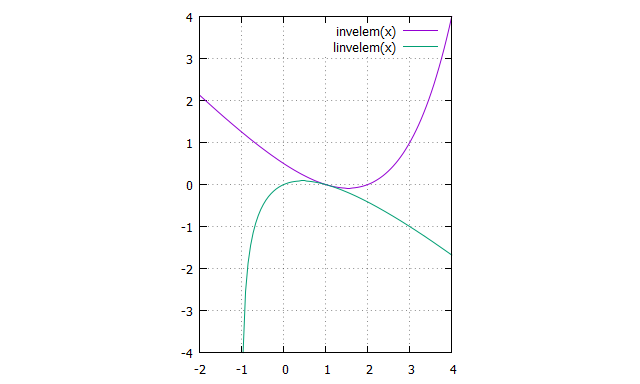

# 2. 対数関数の分解公式

　前章で述べた「真数の逆元」は，本来ならば複素解析学で扱われようものであるが，定義域も値域も実数解であるといった特殊解である。最も，代数方程式で好まれそうな宇宙定数が変数として現れるようなものであり，自然数というよりも二進指数のほうに微分積分学が基礎にある。  
　これが真値であったかのように，真数の逆元を変数で現わそうものなら  

$\frac{2^x}{2}-x, \text{but}\, 1 \leq x \leq 2$  

　として，二進で帰着してしまう。  
　そもそも変数xを相補するものとして対数の累乗根を現す「対数累乗積分 *logarithmic power integral*」から発見したのであるが，これは「真数の逆元の対数」と呼ぶことができるだろう。しかしながら，興味深いことに，現わされた主値には，元となる逆元には累乗根がなく，対数のほうには累乗根がうっすらと現れている。  
　この積分を変数に現そうならば  
 
 $\log_2(1+x)-x, \text{But}\, 0 \leq x \leq 1$
 
　として確認できる。  
　“逆元の対数”より正規化した累乗根 $\sqrt{1+3x}-1$ を差し引くことを考えると，以下の式を得る。  

$\log_2(1+x) - (\sqrt{1+3x}-1), \text{But}\, 0 \leq x \leq 1$

　この解は0を連続しないため，累乗根を積分に持つことが分かる。  
　逆元の主値は実数全体で一価な負の値であり，対数逆元の主値は実数全体で一価な正の値である。特性とも言えるこれはオイラー・ガンマ積分に類似した特徴がある。また，各々主値をフォーカスしてプロットしてみると，三角関数で見受けるような相対性を確認できる。  
　gluplotで以下をタイプしプロットしてみる。

```
set grid
set size ratio -1
log2(x) = log(x)/log(x)
linvelem(x) = log2(1+x)-x
invelem(x) = 2**x/2-x
plot [-2:4] [-4:4] invelem(x), linvelem(x)
```

　以下を得られる。  



　[Wolfram alpha](https://www.wolframalpha.com/input?i2d=true&i=Divide%5BPower%5B2%2Cx%5D%2C2%5D-x%5C%2844%29+log2%5C%2840%291%2Bx%5C%2841%29-x)に尋ねてみると，高次な多価関数であるためか，リーマン・ゼータ関数のクリティカル・ラインで確認できるようなパラメトリック曲線を持つことが分かる。  
